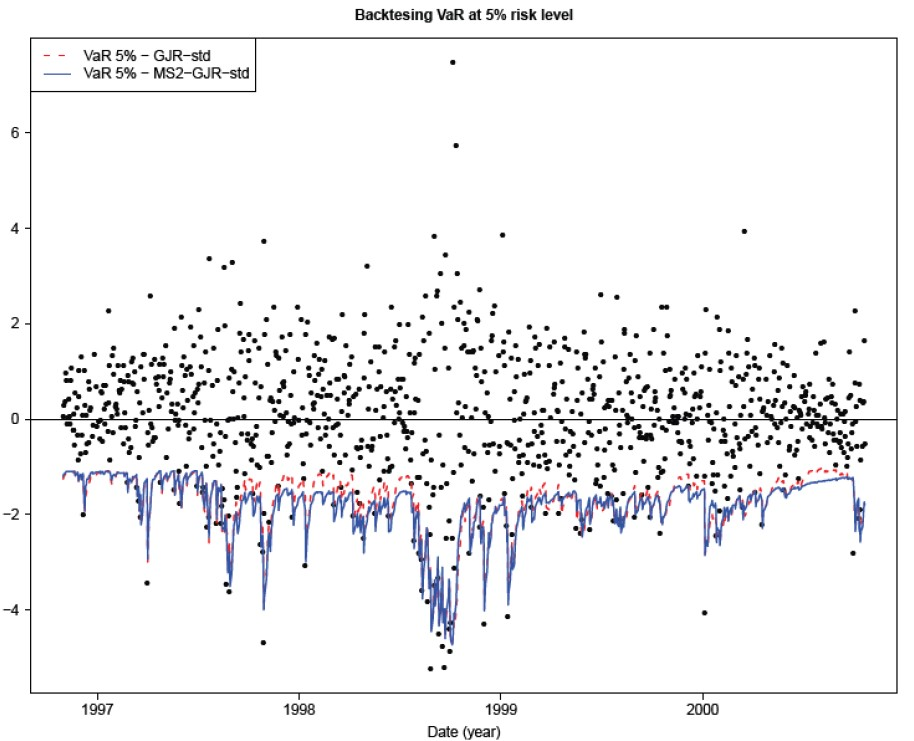

# Markov-Switching GARCH Model for Taiwan Stock Market Risk Analysis
## Project Objective
This project aims to assess financial risk in the Taiwan Stock Market by analyzing stock return volatility and identifying regime shifts using a Markov-Switching GARCH model. By estimating Value at Risk (VaR), we can detect periods of high and low market risk, helping investors and analysts make informed decisions.
## Methods Used
* Time Series Analysis
* Markov-Switching Model
* GARCH Model
## Language
* Python
* R
## Modules
* Pandas
* Matplotlib
* Numpy
* Seaborn
* MSGARCH (R)
* ggplot2 (R)
* gridExtra (R)
## Step-by-Step
1. Dataset Analysis
    * Load Taiwan stock market index data
    * Extract relevant columns for analysis
    * Data Cleaning
2. Handle missing values and duplicates
    * Convert data into time series format
    * Data Transformation
3. Compute log-returns for stock market index
    * Convert data into a numerical vector
4. Data Visualization
    * Plot time series of log-returns
    * Visualize estimated volatility and regime probabilities
5. Model Implementation
    * Train a Markov-Switching GJR-GARCH model
    * Fit the model to stock market log-returns
    * Extract volatility estimates and smoothed regime probabilities
6. Model Evaluation
    * Analyze stock market risk based on volatility estimates
    * Interpret regime-switching probabilities for risk assessment
## Results

The Value at Risk (VaR) in the Taiwan Stock Market fluctuated significantly during the COVID-19 pandemic, indicating increased market volatility and financial risk. The Markov-Switching GARCH model detected clear regime shifts, aligning with economic disruptions.
